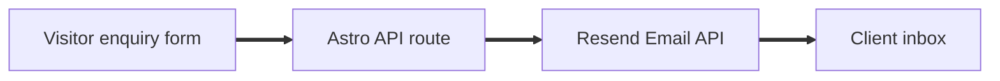

# BSI Solutionz

This project is a public business website for BSI Solutionz. It focuses on product discovery, clear enquiry capture, and fast static pages that are easy to host.

## Tech Stack

Astro is used for the main site because most pages are content led and should load quickly without shipping a full app to the browser.

React is used only where the page needs interaction, mainly the enquiry modal and chatbot style surfaces. This keeps the site simple while still making the important forms feel smooth.

Tailwind CSS is used for styling because it keeps the design system close to the markup and makes small layout changes quick.

Zod and React Hook Form are used for enquiry validation because the form needs clear rules before anything is sent.

Vercel is used for hosting because it fits Astro well and can run the small enquiry API route without a separate server.

Resend is used for email delivery because the client only needs reliable enquiry delivery to their inbox, not a full customer database.

## Enquiry Flow



The form posts to the same site at `/api/enquiry`. The Astro API route validates the request, cleans the values, and sends the email through Resend. The visitor does not receive direct access to email provider secrets.

## Why There Is No Separate Backend

A separate backend was considered and built during planning, but I chose to omit it for the current version. Render free tier services can go cold, and that would make a simple enquiry form feel slow or unreliable after idle periods.

The client does not expect enquiry volume to be high enough for stored backup emails to become the priority. Their main need is to receive leads by email. Because of that, adding a database and an always running backend would create more maintenance than value right now.

This setup keeps the project lean. The site stays fast, the email secret stays on the server side route, and the client can move to stored enquiries later if the volume proves that it is needed.

## Local Commands

Run commands from the `client` folder.

```bash
npm run dev
npm run build
npm run check
```
